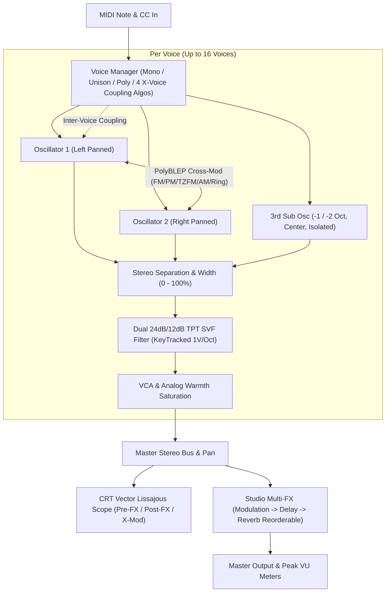

# 🎛️ CROSSMOD SYNTHESIZER — USER MANUAL
### Developed by **mtyas** | JUCE 8 Framework | VST3 • CLAP • Standalone (Windows 64-bit)

---

## 📖 TABLE OF CONTENTS
1. [Introduction & Philosophy](#1-introduction--philosophy)
2. [Installation & Supported Formats](#2-installation--supported-formats)
3. [Signal Flow & Block Diagram](#3-signal-flow--block-diagram)
4. [Oscillator Core, Waveforms & 3rd Sub Oscillator](#4-oscillator-core-waveforms--3rd-sub-oscillator)
5. [Cross-Modulation Engine (5 Modes)](#5-cross-modulation-engine-5-modes)
6. [Real-Time Lissajous CRT Oscilloscope](#6-real-time-lissajous-crt-oscilloscope)
7. [Resonant Filter Section (VCF) & Exact 1V/Oct Key Tracking](#7-resonant-filter-section-vcf--exact-1voct-key-tracking)
8. [VCA, Warmth Saturation & Stereo Imaging](#8-vca-warmth-saturation--stereo-imaging)
9. [Voice Modes (7 Topologies) & Dual Independent Glide](#9-voice-modes-7-topologies--dual-independent-glide)
10. [Audio-Rate LFOs & ADSR Envelopes](#10-audio-rate-lfos--adsr-envelopes)
11. [8-Slot Modulation Matrix & Tuned LFO Tracking](#11-8-slot-modulation-matrix--tuned-lfo-tracking)
12. [Studio Multi-Effects Chain (Order Reconfigurable)](#12-studio-multi-effects-chain-order-reconfigurable)
13. [Preset Management & 11 Factory Presets](#13-preset-management--11-factory-presets)
14. [MIDI Learn & Hardware Controller Integration](#14-midi-learn--hardware-controller-integration)
15. [Sound Design Recipes & Pro Tips](#15-sound-design-recipes--pro-tips)
16. [Complete Parameter & MIDI Specification](#16-complete-parameter--midi-specification)

---

## 1. Introduction & Philosophy

**CrossMod** is an analog-inspired, cross-modulation synthesizer designed by **mtyas**. Rather than relying on static wave-tables or sample playback, CrossMod treats its oscillators and voice stages as dynamic, coupled physical and mathematical systems. 

With **2x sub-sample oversampling**, **PolyBLEP anti-aliasing**, **zero-latency topology-preserving state-variable filtering**, and **5 distinct cross-modulation algorithms**, CrossMod spans an immense sonic continuum: from ultra-clean 80s FM EPianos and glassy bells to screaming cybernetic leads, organic acoustic soundboard simulations, and evolving generative drones.

---

## 2. Installation & Supported Formats

CrossMod is distributed as a universal 64-bit binary across three standard formats:

| Format | Output Location | Default Plugin Directory |
| :--- | :--- | :--- |
| **CLAP** | `build\CrossMod_artefacts\Release\CLAP\CrossMod.clap` | `C:\Program Files\Common Files\CLAP\` |
| **VST3** | `build\CrossMod_artefacts\Release\VST3\CrossMod.vst3` | `C:\Program Files\Common Files\VST3\` |
| **Standalone** | `build\CrossMod_artefacts\Release\Standalone\CrossMod.exe` | Any folder (Portable `.exe` with virtual MIDI/Audio device selector) |

---

## 3. Signal Flow & Block Diagram

---

## 4. Oscillator Core, Waveforms & 3rd Sub Oscillator

### Oscillator 1 (Left Channel Default)
* **Waveform**: Select between **Sine**, **Triangle**, **Saw**, or **Square**. All shapes feature bandlimited **PolyBLEP anti-aliasing** to eliminate high-frequency aliasing clicks.
* **Coarse Tune**: Pitch offset in semitones ($-36\text{ st}$ to $+36\text{ st}$).
* **Fine Tune**: Fine pitch offset in cents ($-100\text{ ct}$ to $+100\text{ ct}$).
* **Level**: Discrete output level ($0.0 - 1.0$).

### Oscillator 2 (Right Channel Default)
* **Waveform**: Select between **Sine**, **Triangle**, **Saw**, or **Square**.
* **Coarse Tune**: Pitch offset in semitones ($-36\text{ st}$ to $+36\text{ st}$).
* **Fine Tune**: Fine pitch offset in cents ($-100\text{ ct}$ to $+100\text{ ct}$).
* **Level**: Discrete output level ($0.0 - 1.0$).

### 3rd Sub Oscillator (Center Channel — Isolated Direct Path)
* **Waveform**: Selectable between **Sine**, **Triangle**, **Saw**, and **Square**.
* **Octave Range**: **-1 Octave** ($-12\text{ st}$) or **-2 Octaves** ($-24\text{ st}$) below Oscillator 1.
* **Sub Level**: Dedicated sub volume control ($0.0 - 1.0$).
* **Direct Path Isolation**: The Sub Oscillator feeds directly into the VCF pre-filter mix at center pan. It does **not** enter the cross-modulation loop, guaranteeing clean, undistorted sub-bass foundations under wild cross-modulation patches.

---

## 5. Cross-Modulation Engine (5 Modes)

CrossMod provides bidirectional modulation where Osc 1 can modulate Osc 2 and Osc 2 can simultaneously modulate Osc 1.

| Mode | Name | Character & Sound Description |
| :---: | :--- | :--- |
| **1** | **FM (Frequency Modulation)** | Analog exponential frequency modulation. Generates rich sidebands, acoustic growls, and brassy harmonic shifts. |
| **2** | **PM (Phase Modulation)** | True Yamaha DX-style linear phase modulation ($\sin(\theta + k \cdot x)$). Produces bright, punchy, crystalline bells, Rhodes, and glassy plucks. |
| **3** | **TZ-FM (Through-Zero FM)** | Linear Through-Zero FM that reverses phase progression when modulated frequency crosses zero. Retains fundamental pitch stability under extreme modulation depths. |
| **4** | **AM (Amplitude Modulation)** | Classic amplitude modulation. Imparts harmonic body coloration, formant vocal textures, and tremolos without altering carrier pitch. |
| **5** | **Ring Mod (Ring Modulation)** | True 4-quadrant four-multiplier ring modulation. Produces clangorous metallic tones, sci-fi chimes, robotic speech timbres, and harsh industrial textures. |

* **1 $\to$ 2 Depth**: Controls the amount of modulation from Osc 1 into Osc 2.
* **2 $\to$ 1 Depth**: Controls the amount of modulation from Osc 2 into Osc 1.

---

## 6. Real-Time Lissajous CRT Oscilloscope

Positioned between the cross-mod knobs, the custom CRT reticle oscilloscope provides pure 2D Lissajous phase monitoring:

1. **X-MOD LISSAJOUS**: Visualizes the internal 2D orbital trajectory between Oscillator 1 ($X$) and Oscillator 2 ($Y$), revealing harmonic ratios, phase locks, and cross-mod deformation.
2. **PRE-FX LISSAJOUS**: Real-time 2D vector stereo phase scope ($X = \text{Left}, Y = \text{Right}$) of the dry synthesizer engine before the multi-effects rack.
3. **POST-FX LISSAJOUS**: Real-time 2D vector stereo phase scope after the Multi-FX chain, displaying stereo widening, chorus motion, delay ping-ponging, and reverb diffusion.

---

## 7. Resonant Filter Section (VCF) & Exact 1V/Oct Key Tracking

CrossMod features a zero-delay Topology-Preserving Transform (TPT) State Variable Filter:
* **Filter Topologies**: **Lowpass 24dB/oct (4-pole cascade)**, **Lowpass 12dB/oct (2-pole)**, **Bandpass 12dB/oct**, and **Highpass 12dB/oct**.
* **1V/Oct Key Tracking**: Setting `FILTER KEY TRACK` to `0.50` produces **exact 1V/Oct 12-TET tuning**. When resonance is raised to maximum ($0.99$), the filter self-oscillates as a pure sine-wave synthesizer tracked cleanly across the entire keyboard. Setting tracking to `1.0` doubles the response to 2V/Oct.
* **Analog Drive**: Soft-saturates the filter core using $C^2$-continuous hyperbolic tangent curves, imparting vintage warmth and harmonic density.
* **Envelope Amount**: Bipolar modulation ($\pm 5\text{ octaves}$) driven by the dedicated Filter ADSR envelope.

---

## 8. VCA, Warmth Saturation & Stereo Imaging

* **Master Volume**: Overall output amplitude gain ($0.0 - 1.0$).
* **Master Pan**: Stereo balance adjustment ($-1.0$ hard left to $+1.0$ hard right).
* **Stereo Width**: Spreads Oscillator 1 to the Left channel and Oscillator 2 to the Right channel ($0\% = \text{true mono mix}, 100\% = \text{full discrete stereo separation}$).
* **VCA Warmth**: Applies tube/tape-style harmonic saturation to the final voice amplifier stage.

---

## 9. Voice Modes (7 Topologies) & Dual Independent Glide

The **VOICE & GLIDE** section unifies voice management into a single dropdown:

1. **Mono**: Pure monophonic mode with high-note priority legato note buffer.
2. **Mono Unison**: Stacks **8 voices** onto a single note with automatic wide stereo spreading and detuning up to **$\pm 12.0\text{ semitones}$** (1 full octave) via the `VOICE X-MOD` knob.
3. **Poly (Multi-Mono)**: Standard 16-voice polyphony where each voice operates independently.
4. **Cyclic Ring**: Daisy-chained closed circular ring modulation loop ($1 \to 2 \to 3 \to \dots \to N \to 1$). Each voice ring-modulates with its neighbor, producing complex metallic bell beating.
5. **Sympathetic All**: Acoustic soundboard body modeling. Computes the composite vibration of all held keys and feeds resonant formant modulation into all voices, sounding like an acoustic grand piano body.
6. **Root Driver**: The lowest held pitch acts as master carrier driver, heavily modulating upper harmonic chords ($v_{\text{root}} \times 2.2$), while upper voices feed 2nd-harmonic shimmer back to the root.
7. **Chaos Diffuse**: Non-linear chaotic phase differential network ($\tanh(2.5 \cdot \Delta v) + 0.35 \cdot \sin(6.28 \cdot v) - 0.2 \cdot v^3$), producing evolving generative textures and analog phase distortion.

* **Dual Independent Glide (Glide 1 & Glide 2)**: Set separate portamento glide times for Oscillator 1 and Oscillator 2 ($0.00\text{ s} - 2.50\text{ s}$). Polyphonic glide works across all poly modes!

---

## 10. Audio-Rate LFOs & ADSR Envelopes

### Audio-Rate LFO 1 & LFO 2
* **Rate Range**: $0.01\text{ Hz}$ (ultra-slow 100-second cycles) to **$2000.0\text{ Hz}$** (audio frequencies).
* **Waveforms**: **Sine**, **Triangle**, **Saw Up**, **Saw Down**, **Square**, and **Sample & Hold**.
* **BPM Sync**: Synchronizes to DAW tempo across 15 musical subdivisions (1/32 to 4 Bars including triplets and dotted notes).
* **Key Retrigger**: Restarts LFO phase on note strike.

### Triple ADSR Envelopes
* **Amp Envelope**: Dedicated amplitude contour with smooth exponential decay and release.
* **Filter Envelope**: Cutoff contour with bipolar depth control.
* **Mod Envelope**: General-purpose modulation envelope routed via the Matrix.

---

## 11. 8-Slot Modulation Matrix & Tuned LFO Tracking

Connect any of the **10 modulation sources** to **25 modulation destinations**:

### Modulation Sources:
`LFO 1`, `LFO 2`, `Amp Env`, `Filter Env`, `Mod Env`, `Random S&H`, `Velocity`, `Mod Wheel (CC 1)`, `Pitch Bend`, `Key Track`.

### Key Matrix Feature: LFO Pitch Tracking as 3rd/4th Oscillators
* By routing **`Key Track` $\to$ `LFO 1 Rate`** with **`Amount = +0.50`**, the audio-rate LFO tracks the keyboard in **exact 1V/Oct 12-TET tuning**.
* Route LFO 1 to Filter Cutoff or Pitch to achieve tuned 3-oscillator FM or tuned formant modulation!

---

## 12. Studio Multi-Effects Chain (Order Reconfigurable)

CrossMod includes a three-stage effects processor with **4 selectable routing orders**:
* `MOD > DLY > RVB` (Classic Studio)
* `DLY > MOD > RVB` (Ambient Flanger Delay)
* `MOD > RVB > DLY` (Diffused Delays)
* `RVB > DLY > MOD` (Shoegaze Reverb Chorus)

### 1. Modulation Effect
* **Types**: **Chorus** (quadrature stereo delay), **Flanger** (high-feedback comb filter), **Phaser** (6-stage allpass ladder), **Ensemble** (multi-tap lush string machine chorus).
* **Controls**: `RATE` ($0.05 - 15\text{ Hz}$), `DEPTH`, `FEEDBACK`, `MIX`.

### 2. Delay Effect
* **Types**: **Tape Delay** (analog tape wow/flutter and pitch-glide inertia), **BBD Analog** (bucket-brigade warm dark roll-off), **Digital Delay** (glitch-free dual-tap crossfade), **Ping-Pong** (alternating stereo bounces).
* **Controls**: `TIME` ($0.01 - 1.8\text{ s}$ or BPM Sync), `FEEDBACK`, `TONE` (lowpass damping), `MIX`.

### 3. Reverb Effect
* **Types**: **Plate Reverb** (bright, fast diffusion), **Room Reverb** (warm studio ambience), **Hall Reverb** (deep cinematic space with 40ms pre-delay).
* **Controls**: `DECAY` ($0.1 - 10.0\text{ s}$), `DAMPING`, `TONE`, `MIX`.

---

## 13. Preset Management & 11 Factory Presets

CrossMod includes 11 factory presets crafted by **mtyas**:
1. **`01 - Init Dual Sine`**: Clean benchmark dual sine sound with subtle saturation.
2. **`02 - Deep Cross Bass`**: Punchy sub-bass with gentle 1->2 cross modulation.
3. **`03 - Galactic Bell Matrix`**: Shimmering crystalline bells using Phase Modulation.
4. **`04 - Inter-Voice Shimmer (X-Voice)`**: Sympathetic All polyphonic body resonance.
5. **`05 - Coupled Harmonic String (X-Voice)`**: Root Driver harmonic physical model.
6. **`06 - Cybernetic Lead`**: Aggressive Through-Zero FM mono lead.
7. **`07 - Lush Vintage Brass`**: Rich 8-voice Mono Unison brass stack.
8. **`08 - Alien Ring Mod Poly (X-Voice)`**: Cyclic Ring polyphonic inter-voice beating.
9. **`09 - BigBass`**: Heavy, earth-shaking sub-bass reinforced by the 3rd Sub Oscillator.
10. **`10 - Sick Robot`**: Gritty robotic formant growl with audio-rate LFO filter modulation.
11. **`11 - Unstable keys`**: Atmospheric generative keys using Chaos Diffuse polyphony.

---

## 14. MIDI Learn & Hardware Controller Integration

* **Right-Click Any Knob**: Select **"Learn MIDI CC"** from the context popup. Turn any knob or fader on your hardware MIDI keyboard to bind it instantly.
* **Persistent Storage**: All custom MIDI CC mappings are automatically serialized into `C:\Users\matth\Documents\mtyas\CrossMod\midi_mappings.xml` and restored on startup.
* **Unmap**: Right-click any mapped parameter and choose **"Clear MIDI Mapping"**.

---

## 15. Sound Design Recipes & Pro Tips

### 🌟 1. Glassy DX7-Style Electric Piano
* **Osc 1**: Sine Wave, Coarse = 0, Level = 0.8
* **Osc 2**: Sine Wave, Coarse = +14 st (Octave + Major 2nd), Level = 0.0
* **Cross-Mod Mode**: **PM (Phase Mod)**, `1 -> 2 Depth` = 0.45
* **Mod Matrix**: `Velocity` $\to$ `CrossMod 1->2` (Amount = +0.65)
* **Effects**: Chorus (Rate 0.8 Hz, Mix 35%) + Plate Reverb (Decay 2.5s, Mix 25%)

### 🌟 2. Massive Sub-Bass with Crisp Attack
* **Osc 1**: Saw Wave, Level = 0.6
* **Osc 2**: Square Wave, Coarse = 0, Level = 0.4
* **3rd Sub Osc**: **Sine Wave**, Octave = **-2 Octaves**, Sub Level = 0.9
* **Filter**: Lowpass 24dB, Cutoff = 350 Hz, Resonance = 0.15, Env Amt = +0.40, Filter Decay = 0.25s
* **Stereo Width**: 0% (solid mono bass punch)

### 🌟 3. Tuned 3rd Oscillator FM Growl
* **LFO 1**: Rate = 220 Hz, Shape = Sine
* **Mod Matrix Slot 0**: `Key Track` $\to$ `LFO 1 Rate` (Amount = +0.50) -> *Now LFO 1 is in perfect 1V/Oct keyboard tune!*
* **Mod Matrix Slot 1**: `LFO 1` $\to$ `Filter Cutoff` (Amount = +0.60)
* **Filter**: Cutoff = 600 Hz, Resonance = 0.75, Drive = 0.50

---

## 16. Complete Parameter & MIDI Specification

| Parameter ID | Name | Range | Default | Description |
| :--- | :--- | :--- | :--- | :--- |
| `voiceMode` | Voice Mode | 0 to 6 | 2 (Poly) | Mono, Unison, Poly, Cyclic, Symp, Root, Chaos |
| `glideTime` / `osc1Glide` | Osc 1 Glide | 0.0 to 2.5 s | 0.05 s | Osc 1 Portamento Glide Time |
| `osc2Glide` | Osc 2 Glide | 0.0 to 2.5 s | 0.05 s | Osc 2 Portamento Glide Time |
| `voiceCrossMod` | Voice X-Mod | 0.0 to 1.0 | 0.0 | Unison detune or Poly X-Mod depth |
| `stereoWidth` | Stereo Width | 0.0 to 1.0 | 0.75 | 0% Mono to 100% Discrete Stereo |
| `crossModMode` | X-Mod Mode | 0 to 4 | 0 (FM) | FM, PM, TZFM, AM, RingMod |
| `crossMod1to2` | 1 -> 2 Depth | 0.0 to 1.0 | 0.0 | Modulation Osc 1 into Osc 2 |
| `crossMod2to1` | 2 -> 1 Depth | 0.0 to 1.0 | 0.0 | Modulation Osc 2 into Osc 1 |
| `subOscWaveform` | Sub Wave | 0 to 3 | 0 (Sine) | Sine, Tri, Saw, Square |
| `subOscOctave` | Sub Octave | 0 to 1 | 0 (-1 Oct) | -1 Octave or -2 Octaves |
| `subOscLevel` | Sub Level | 0.0 to 1.0 | 0.0 | Volume of isolated 3rd Sub Osc |
| `filterCutoff` | Cutoff | 20 to 20000 Hz | 15000 Hz | Filter Cutoff Frequency |
| `filterResonance` | Resonance | 0.0 to 1.0 | 0.1 | Filter Q / Self-oscillation |
| `filterKeyTrack` | Key Track | 0.0 to 1.0 | 0.2 (0.5=1V/Oct) | Keyboard Cutoff Tracking |
| `vcaSaturation` | VCA Warmth | 0.0 to 1.0 | 0.1 | Analog Tube Saturation |
| `fxRoutingOrder` | FX Order | 0 to 3 | 0 (M-D-R) | Multi-FX stage order |

---
*Manual compiled for CrossMod Synthesizer Release v1.2.0.*
