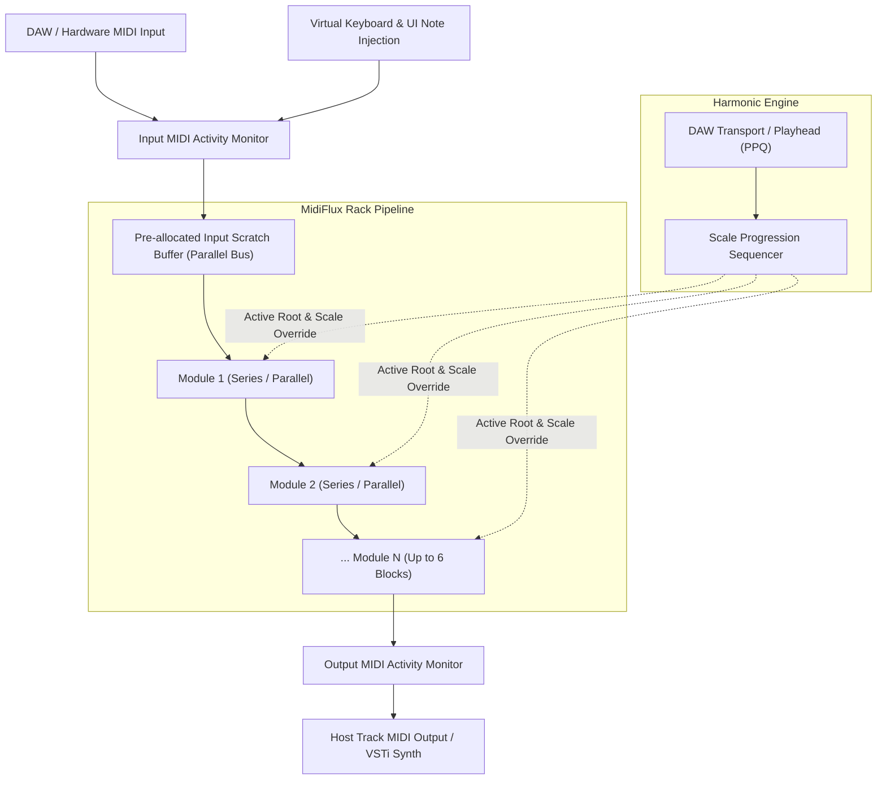

# 🎹 MIDIFLUX — USER MANUAL
### Generative MIDI Rack & Harmonic Sequencer
### Developed by **mtyas** | JUCE 8 Framework | VST3 • CLAP • Standalone (Windows 64-bit)

---

## 📖 TABLE OF CONTENTS
1. [Introduction & Philosophy](#1-introduction--philosophy)
2. [Installation & Formats](#2-installation--formats)
3. [Signal Flow & Processing Topology](#3-signal-flow--processing-topology)
4. [The Modular Rack & Global Controls](#4-the-modular-rack--global-controls)
   - 4.1 [Header Controls & Dice Randomizer](#41-header-controls--dice-randomizer)
   - 4.2 [Rack Layout & Module Drag-and-Drop](#42-rack-layout--module-drag-and-drop)
   - 4.3 [Series vs. Parallel Routing](#43-series-vs-parallel-routing)
   - 4.4 [Solo, Bypass & Clean Release Logic](#44-solo-bypass--clean-release-logic)
   - 4.5 [DAW Transport & Sync Status](#45-daw-transport--sync-status)
5. [Scale Progression Sequencer](#5-scale-progression-sequencer)
   - 5.1 [Timeline & Block Editor](#51-timeline--block-editor)
   - 5.2 [DAW Song Synchronization](#52-daw-song-synchronization)
   - 5.3 [Progression Presets & File Management](#53-progression-presets--file-management)
6. [The 16 Processing Modules (Complete Reference)](#6-the-16-processing-modules-complete-reference)
   - 6.1 [Arpeggiator](#61-arpeggiator)
   - 6.2 [Chord Generator](#62-chord-generator)
   - 6.3 [Euclidean Rhythm Generator](#63-euclidean-rhythm-generator)
   - 6.4 [Harmonizer](#64-harmonizer)
   - 6.5 [MIDI Delay & Echo](#65-midi-delay--echo)
   - 6.6 [Ratchet / Note Burst](#66-ratchet--note-burst)
   - 6.7 [Humanizer](#67-humanizer)
   - 6.8 [Scale Quantizer](#68-scale-quantizer)
   - 6.9 [Time Quantizer](#69-time-quantizer)
   - 6.10 [LFO / CC Modulator](#610-lfo--cc-modulator)
   - 6.11 [Transform (Invert & Mirror)](#611-transform-invert--mirror)
   - 6.12 [Probability / Gate](#612-probability--gate)
   - 6.13 [Transpose](#613-transpose)
   - 6.14 [Mutator](#614-mutator)
   - 6.15 [Filter (Key & Velocity Splitter)](#615-filter-key--velocity-splitter)
   - 6.16 [Mapper / Remapper](#616-mapper--remapper)
7. [Virtual Performance Keyboard](#7-virtual-performance-keyboard)
8. [Preset Management & State Persistence](#8-preset-management--state-persistence)
9. [MIDI Learn & Hardware Mapping](#9-midi-learn--hardware-mapping)
10. [Under the Hood: Zero-Allocation Real-Time Engine](#10-under-the-hood-zero-allocation-real-time-engine)
11. [Troubleshooting & FAQ](#11-troubleshooting--faq)

---

## 1. Introduction & Philosophy

**MidiFlux** is an advanced modular MIDI transformation and generative sequencing environment created by **mtyas**. Designed to bridge expressive live performance, intelligent algorithmic composition, and DAW song automation, MidiFlux acts as an intelligent neural layer between your keyboard/controller and your favorite software or hardware synthesizers.

Whether transforming single-finger notes into intricate neoclassical arpeggios, introducing subtle human micro-timing and loose grooves to rigid MIDI sequences, or driving harmonic song structures using the integrated Scale Progression Sequencer, MidiFlux provides a flexible rack environment where modules can be re-ordered, combined, and routed in series or parallel.

### Key Capabilities:
- **16 Modular Processing Blocks**: Covering algorithmic arpeggiation, polyphonic voicing, euclidean polyrhythms, generative micro-mutation, swing/time quantization, and MIDI CC automation.
- **Scale Progression Sequencer**: Automate musical scale and root changes throughout your DAW project timeline in synchronized blocks (from $1/4$ bar up to $16$ bars).
- **Flexible Signal Architecture**: Choose between traditional **Series** daisy-chaining and **Parallel** routing per module for complex split-stream layering.
- **Zero-Allocation Audio Engine**: Pre-allocated scratch buffers, lock-free visual telemetry, and non-blocking thread isolation ensure rock-solid stability and zero audio dropouts.
- **Hardware Integration**: Comprehensive MIDI Learn with persistent XML mappings across every knob and toggle.

---

## 2. Installation & Formats

MidiFlux is compiled natively for 64-bit Windows systems in the following standard formats:

| Format | File Name | Typical Host Location | Description |
| :--- | :--- | :--- | :--- |
| **VST3** | `MidiFlux.vst3` | `C:\Program Files\Common Files\VST3\` | Universal VST3 MIDI Processor / Instrument plugin compatible with Reaper, Ableton Live, Cubase, Bitwig, FL Studio, Studio One. |
| **CLAP** | `MidiFlux.clap` | `C:\Program Files\Common Files\CLAP\` | High-performance modern plugin format with native parameter modulation and sample-accurate automation. |
| **Standalone** | `MidiFlux.exe` | Portable Executable | Standalone application featuring direct Windows MIDI In / Out device routing for live performance without a DAW. |

---

## 3. Signal Flow & Processing Topology

MidiFlux processes incoming MIDI messages through an ordered pipeline of processing modules before forwarding the enriched MIDI stream to the host DAW track or external synthesizers:



### Signal Highlights:
1. **Virtual Key Injection**: Notes played on the lower interactive keyboard or injected via UI chord-hold enter the processing stream with non-blocking thread safety.
2. **Harmonic Sync**: The global Scale Sequencer broadcasts the current musical Root Note and Scale Type to all diatonic modules (Scale Quantizer, Arpeggiator, Chord Generator, Harmonizer).
3. **Double Buffering**: Events flow between modules using zero-copy buffer swaps, keeping latency below detectable thresholds.

---

## 4. The Modular Rack & Global Controls

### 4.1 Header Controls & Dice Randomizer
The top header provides immediate access to essential session-wide settings:
- **Plugin Logo / Brand**: Displays the **mtyas MidiFlux** signature.
- **Master Bypass**: Toggles plugin bypass. When bypassed, incoming MIDI is passed through directly to output untouched.
- **Global Root & Scale Dropdowns**: Sets the default musical key (e.g., *D Dorian*, *F# Minor*, *C Lydian*) used by all harmonic modules when the Scale Progression Sequencer is off.
- **Scale Sequencer Toggle**: Expands the Scale Progression Sequencer strip directly below the header.
- **Panic Button (!)**: Instantly issues `All Notes Off` (CC 123) and `All Sound Off` (CC 120) across all 16 MIDI channels, immediately silencing any hung notes.
- **Dice Randomizer (🎲)**: Generates an entirely fresh, musically coherent rack configuration. Clears existing modules and spawns between 1 and 6 distinct modules with randomized parameters and creative routings.

### 4.2 Rack Layout & Module Drag-and-Drop
The central rack hosts up to 6 simultaneous modules:
- **Add Module (+)**: Displays a categorized popup menu (*Arp/Rhythm*, *Harmonic*, *Generative*, *Utility*) allowing you to insert any of the 16 available blocks.
- **Drag-and-Drop Reordering**: Click and drag any module card by its top header bar to reorder its position in the processing chain. The remaining cards dynamically shift to accommodate the new layout.
- **Card Controls**:
  - **Power Toggle**: Enables or disables the individual module.
  - **Solo Button (S)**: Isolates the module; all other modules in the rack are bypassed.
  - **Routing Switch (SER / PAR)**: Toggles the block's input source between Series and Parallel.
  - **Delete Button (×)**: Removes the module from the rack.

### 4.3 Series vs. Parallel Routing
Each module can be independently switched between two routing topologies:
- **Series (`SER`)**: The module receives the output of the preceding block. Changes are cumulative (e.g., `Chord Generator -> Arpeggiator` turns triggered chords into arpeggiated patterns).
- **Parallel (`PAR`)**: The module bypasses preceding processing blocks and receives the raw, untouched MIDI input directly from the DAW/keyboard. Its output is then merged into the main chain. This enables parallel layering (e.g., keeping an untouched lead melody while a parallel Harmonizer generates accompanying voices).

### 4.4 Solo, Bypass & Clean Release Logic
A major problem in modular MIDI processors is "stuck notes" occurring when a module is bypassed while notes are actively playing. MidiFlux solves this with **Intelligent Bypass Flushing**:
- When any block is bypassed (or de-soloed), MidiFlux automatically interrogates the block's internal active note registry and dispatches matching `Note Off` messages immediately into the stream.
- Deactivating an Arpeggiator, Chord Generator, or Delay module will never leave a synth sounding indefinitely.

### 4.5 DAW Transport & Sync Status
Modules that rely on rhythmic timing (such as Euclidean rhythms or Beat-synced LFOs) display an ambient notice when the DAW transport is halted:
- An unobtrusive message `Requires DAW Playhead` is shown when host playback is stopped, indicating that starting playback will engage full beat synchronization.

---

## 5. Scale Progression Sequencer

The **Scale Progression Sequencer** enables dynamic harmonic changes across your song timeline, eliminating the need to automate scale parameters manually across multiple tracks.

```
[ Bar 1.0 - 5.0: C Major (4 Bars) ] ──▶ [ Bar 5.0 - 7.0: A Minor (2 Bars) ] ──▶ [ Bar 7.0 - 8.0: F Lydian (1 Bar) ]
```

### 5.1 Timeline & Block Editor
- **Add Block (+)**: Appends a harmonic step to the timeline.
- **Root Key Dropdown**: Selects the root note (C, C#, D, ... B).
- **Scale Dropdown**: Selects from 14 musical modes (Major, Minor, Dorian, Phrygian, Lydian, Mixolydian, Locrian, Harmonic Minor, Melodic Minor, Pentatonic Major/Minor, Blues, Whole Tone, Diminished).
- **Duration**: Configurable in musical increments from **1/4 Bar** (1 beat) up to **16 Bars** ($1/4$, $1/2$, $1$, $2$, $4$, $8$, $16$ bars).
- **Loop Toggle**: When enabled, the progression loops indefinitely once the playhead reaches the end of the last block.

### 5.2 DAW Song Synchronization
The sequencer links directly to the host's playhead position (PPQ - Pulses Per Quarter Note). As your DAW plays through the timeline:
- The sequencer calculates the active block based on absolute song time.
- The active block is highlighted in real-time with an animated glowing accent border.
- The resolved Root and Scale are automatically broadcast to all diatonic modules.

### 5.3 Progression Presets & File Management
Progressions can be saved and recalled independently of overall plugin presets:
- **Preset Dropdown**: Built-in factory progressions (e.g., *Pop 4-Chords*, *Jazz 2-5-1*, *Modal Fusion*, *Epic Cinematic*).
- **Save / Save As**: Save your custom chord progressions to disk as `.mfprog` XML files.
- **Load**: Open previously exported progression files from any project.

---

## 6. The 16 Processing Modules (Complete Reference)

---

### 6.1 Arpeggiator
Turns held chords or single notes into expressive rhythmic sequences.
- **Accent Color**: Orange (`#f97316`)
- **Category**: Arp / Rhythm
- **Parameters**:
  - `Pattern`: **Up**, **Down**, **Up/Down**, **Down/Up**, **Random**, **Chord** (repeating chord stabs), **As Played** (preserves the physical note press order).
  - `Rate`: Synced note division (**1/4**, **1/8**, **1/16**, **1/32**, including Triplets and Dotted).
  - `Octaves`: Octave range ($1$ to $4$ octaves).
  - `Gate`: Note duration percentage ($10\%$ to $150\%$). Values over $100\%$ produce legato overlap.
  - `Swing`: Shuffle offset ($-50\%$ to $+50\%$).
  - `Hold`: Key latch toggle. When enabled, the arpeggiator continues cycling through held notes after physical keys are released. Automatically responds to Sustain Pedal (CC 64).
  - `Hold Mode`: **Standard** (adds notes to active pattern) or **Chord Latch** (replaces old chord with new chord when played).

---

### 6.2 Chord Generator
Expands single incoming notes into full diatonic or chromatic chords with natural human strumming.
- **Accent Color**: Rose Red (`#f43f5e`)
- **Category**: Harmonic
- **Parameters**:
  - `Type`: **Diatonic Auto** (intelligently picks major, minor, or diminished chords based on active project scale), **Major**, **Minor**, **Dominant 7**, **Major 7**, **Minor 7**, **Sus2**, **Sus4**, **Diminished**, **9th**, **Power**.
  - `Inversion`: **Root**, **1st Inversion**, **2nd Inversion**, **3rd Inversion**, or **Random Inversion**.
  - `Voicing`: **Close**, **Drop-2**, **Drop-3**, **Spread Open**.
  - `Strum (ms)`: Inter-note delay ($0\text{ ms}$ to $100\text{ ms}$) simulating guitar strums or keyboard rolls.
  - `Strum Dir`: **Up**, **Down**, **Alternate** (swaps direction every note), **Random**.
  - `Vel Ramp`: Dynamics slope from first strummed note to last ($-50\%$ to $+50\%$).
  - `Drop Note`: Probability ($0\%$ to $50\%$) of randomly omitting one note for realistic human variation.

---

### 6.3 Euclidean Rhythm Generator
Distributes a set number of rhythmic pulses evenly across a chosen step length based on the Euclidean algorithm.
- **Accent Color**: Amber Gold (`#eab308`)
- **Category**: Arp / Rhythm
- **Parameters**:
  - `Steps`: Pattern length ($1$ to $32$ steps).
  - `Hits`: Number of active pulses distributed across the step sequence ($0$ to $32$).
  - `Rotate`: Shifts the starting point of the euclidean pattern clockwise ($0$ to $31$ steps).
  - `Gate`: Pulse duration ($10\%$ to $100\%$).
  - `Accent`: Velocity boost applied to the first beat of each cycle ($0\%$ to $100\%$).

---

### 6.4 Harmonizer
Generates parallel diatonic or chromatic harmony lines beneath or above your melody.
- **Accent Color**: Royal Purple (`#9333ea`)
- **Category**: Harmonic
- **Parameters**:
  - `Voice 1 Interval`: **Off**, **Diatonic 3rd Up**, **Diatonic 3rd Down**, **Diatonic 5th Up**, **Diatonic 6th Up**, **Octave Up**, **Octave Down**, **Chromatic 5th Up (+7 st)**.
  - `Voice 2 Interval`: Identical options to Voice 1 for rich three-part harmonies.
  - `Voice 1 Vel`: Relative velocity scale for Voice 1 ($10\%$ to $150\%$).
  - `Voice 2 Vel`: Relative velocity scale for Voice 2 ($10\%$ to $150\%$).
  - `Probability`: Chance of generating harmony notes on each event ($0\%$ to $100\%$).

---

### 6.5 MIDI Delay & Echo
A MIDI-based echo effect that generates successive repeated notes with musical pitch transposition and velocity decay.
- **Accent Color**: Cyan Blue (`#06b6d4`)
- **Category**: Arp / Rhythm
- **Parameters**:
  - `Time`: Sync rate (**1/4**, **1/8**, **1/16**, **1/32**, Triplets, Dotted).
  - `Feedback`: Number of echo repeats ($1$ to $16$).
  - `Vel Decay`: Volume change per repeat. Ranges from $-100\%$ (fading out) to **$+200\%$** (dynamic crescendo swells).
  - `Pitch Shift`: Semitone transpose applied cumulatively to each successive echo ($-12\text{ st}$ to $+12\text{ st}$).
  - `Diatonic Lock`: When enabled, transpositions snap to the active scale rather than chromatic steps.

---

### 6.6 Ratchet / Note Burst
Triggers rapid note rolls (trap-style hi-hat rolls or IDM synth bursts) on incoming notes.
- **Accent Color**: Crimson (`#e11d48`)
- **Category**: Arp / Rhythm
- **Parameters**:
  - `Roll Chance`: Probability of triggering a ratchet burst on each incoming note ($0\%$ to $100\%$).
  - `Repeats`: Number of sub-notes generated (**2x**, **3x**, **4x**, **6x**, **8x**, **Random**).
  - `Speed`: Rate of burst notes (**1/16**, **1/32**, **1/64**).
  - `Dynamics`: Velocity slope across the burst ($-50\%$ decrescendo to $+50\%$ crescendo).

---

### 6.7 Humanizer
Introduces subtle timing imperfections, micro-groove push/pull, and velocity dynamics to eliminate mechanical rigidity.
- **Accent Color**: Emerald Green (`#10b981`)
- **Category**: Generative
- **Parameters**:
  - `Time Jitter`: Random timing variance ($0\text{ ms}$ to $100\text{ ms}$).
  - `Push / Pull`: Pocket shift ($-50\text{ ms}$ rushing ahead to $+50\text{ ms}$ dragging behind the beat).
  - `Vel Jitter`: Velocity randomization amount ($\pm 0$ to $\pm 60$).
  - `Gate Jitter`: Note duration variance ($0\%$ to $100\%$).
  - `Groove Feel`: Timing distribution curve (**Natural Gaussian**, **Loose / Drunk**, **Laid-Back**, **Rushing**).

---

### 6.8 Scale Quantizer
Forces incoming arbitrary or out-of-key notes onto the active musical scale.
- **Accent Color**: Indigo Glow (`#6366f1`)
- **Category**: Harmonic
- **Parameters**:
  - `Strength`: Degree of pitch correction ($0\%$ = chromatic bypass, $100\%$ = strictly locked to scale).
  - `Direction`: Nearest pitch rounding rule (**Nearest**, **Always Down**, **Always Up**).
  - `Root Override`: Allows locking the quantizer to a specific root independent of the global sequencer.
  - `Scale Override`: Allows locking to a specific scale independent of the global sequencer.

---

### 6.9 Time Quantizer
Snaps incoming live keyboard performance notes to a tight rhythmic grid in real-time.
- **Accent Color**: Blue (`#3b82f6`)
- **Category**: Arp / Rhythm
- **Parameters**:
  - `Grid`: Quantization division (**1/4**, **1/4T**, **1/4D**, **1/8**, **1/8T**, **1/8D**, **1/16**, **1/16T**, **1/16D**, **1/32**, **1/32T**, **1/32D**).
  - `Strength`: Correction factor ($0\%$ to $100\%$).
  - `Swing`: Grid shuffle amount ($-50\%$ to $+50\%$).
  - `Preserve Gate`: Retains original note duration regardless of timing shifts.

---

### 6.10 LFO / CC Modulator
Generates continuous MIDI Control Change (CC) modulation curves synced to DAW tempo or free-running.
- **Accent Color**: Sky Blue (`#0ea5e9`)
- **Category**: Utility
- **Parameters**:
  - `Target CC`: Target MIDI CC destination number ($0$ to $127$, e.g., CC 1 Mod Wheel, CC 11 Expression, CC 74 Cutoff).
  - `Waveform`: **Sine**, **Triangle**, **Saw Up**, **Saw Down**, **Square**, **Sample & Hold (Random)**.
  - `Rate`: Free rate ($0.1\text{ Hz}$ to $20\text{ Hz}$) or DAW beat-synced division ($8\text{ Bars}$ to $1/32\text{T}$).
  - `Depth`: Modulation amplitude ($0\%$ to $100\%$).
  - `Offset`: Center bias value ($0$ to $127$).

---

### 6.11 Transform (Invert & Mirror)
Applies musical geometric transformations to pitch and velocity contours.
- **Accent Color**: Magenta (`#ec4899`)
- **Category**: Utility
- **Parameters**:
  - `Invert Pitch`: Inverts melody around a selected center pitch axis (higher notes become lower).
  - `Center Key`: Center axis note ($C0$ to $B8$, default Middle C / $60$).
  - `Invert Vel`: Flips velocity dynamics ($127 - \text{vel}$). Soft notes become loud; loud accents become ghost notes.
  - `Vel Compress`: Squeezes dynamic range toward a uniform velocity level ($0\%$ to $100\%$).

---

### 6.12 Probability / Gate
Introduces algorithmic indeterminacy by selectively allowing or dropping notes.
- **Accent Color**: Violet (`#8b5cf6`)
- **Category**: Generative
- **Parameters**:
  - `Pass Chance`: Probability of an incoming note passing through ($0\%$ to $100\%$).
  - `Vel Threshold`: Minimum incoming velocity required to be eligible for gating ($1$ to $127$).
  - `Octave Jump`: Probability ($0\%$ to $100\%$) of an accepted note jumping $\pm 1$ octave.
  - `Seed / Mode`: **True Random** or **Deterministic Cycle**.

---

### 6.13 Transpose
Shifts incoming notes by semitones and octaves with optional diatonic scale clamping.
- **Accent Color**: Teal (`#14b8a6`)
- **Category**: Utility
- **Parameters**:
  - `Semitones`: Fine pitch transposition ($-24\text{ st}$ to $+24\text{ st}$).
  - `Octaves`: Coarse octave transposition ($-3$ to $+3$ octaves).
  - `Scale Snap`: Forces transposed results back into the active musical scale.

---

### 6.14 Mutator
Generates organic, evolving musical variations by occasionally swapping pitches or introducing interval drift.
- **Accent Color**: Bright Emerald (`#10b981`)
- **Category**: Generative
- **Parameters**:
  - `Mutation Rate`: Probability of an incoming note mutating ($0\%$ to $100\%$).
  - `Max Drift`: Maximum interval offset in semitones ($\pm 1$ to $\pm 12\text{ st}$).
  - `Octave Jump`: Chance of unexpected octave displacement.
  - `Diatonic Only`: Restricts all pitch mutations strictly to in-scale degrees.

---

### 6.15 Filter (Key & Velocity Splitter)
Restricts notes based on keyboard pitch zones and velocity dynamics, ideal for multi-instrument keyboard splits.
- **Accent Color**: Slate Gray (`#64748b`)
- **Category**: Utility
- **Parameters**:
  - `Min Key`: Lowest allowed MIDI note ($0$ to $127$).
  - `Max Key`: Highest allowed MIDI note ($0$ to $127$).
  - `Min Velocity`: Minimum velocity threshold ($1$ to $127$).
  - `Max Velocity`: Maximum velocity threshold ($1$ to $127$).

---

### 6.16 Mapper / Remapper
Remaps specific input pitches to new target notes, ideal for custom drum rack conversion or non-standard tunings.
- **Accent Color**: Orange-Amber (`#f59e0b`)
- **Category**: Utility
- **Parameters**:
  - `Map Mode`: **1-to-1 Pitch**, **Range Clamp**, **Octave Fold**.
  - `In Root`: Source root note.
  - `Out Root`: Target destination root note.
  - `Channel Remap`: Re-routes incoming messages to a dedicated MIDI channel ($1$ to $16$).

---

## 7. Virtual Performance Keyboard

MidiFlux features a full-width interactive virtual keyboard along the bottom of the interface:

```
[ Hide / Show ] [ Hold / Latch: ON/OFF ] [ Octave: C3 - B5 ] [ ◀ Pan Left | Pan Right ▶ ]
[ ||| | ||| | ||| | ||| | ||| | ||| | ||| | ||| | ||| | ||| | ||| | ||| | ||| | ||| | ||| ]
```

### Features:
1. **Vertical Velocity Sensitivity**:
   - Clicking near the **bottom** of a key produces maximum velocity ($127$).
   - Clicking near the **top** produces soft ghost notes ($\approx 30$).
2. **Scroll & Pan**:
   - Right-click and drag anywhere across the keyboard to scroll smoothly between sub-bass ($C-1$) and high treble ($G9$).
   - Octave reference labels clearly indicate register positions.
3. **Chord Hold Mode**:
   - Engaging the **Hold** button allows you to click multiple keys in succession without releasing them, constructing complex chords on-screen that feed directly into the Arpeggiator or Harmonizer.
4. **Hidable Drawer**:
   - Click the **Keyboard Toggle** button in the footer to collapse the keyboard when working in compact screen spaces.

---

## 8. Preset Management & State Persistence

MidiFlux includes a full preset manager that persists every aspect of your session:
- **Factory Presets**: Includes crafted production setups (*Cinematic Arp Cascades*, *Lo-Fi Soul Chords*, *Trap Hi-Hat Rolls*, *Evolving Ambient Drone*, *Tight Funk Quantize*).
- **Editable Presets**: Modify any factory preset or create custom presets. Saving updates the `.mfpreset` XML file directly.
- **Save / Save As / Delete**: Manage your preset library directly inside the plugin UI.
- **Full DAW Session Recall**: When saving your DAW project, the entire state (rack arrangement, parameter values, progression timeline, and MIDI CC bindings) is embedded seamlessly.

---

## 9. MIDI Learn & Hardware Mapping

Every rotary knob and toggle in MidiFlux supports instant hardware MIDI mapping:
1. **Engage Learn**: Right-click on any knob or parameter control and select **MIDI Learn**.
2. **Move Hardware Controller**: Turn the physical knob, fader, or wheel on your MIDI keyboard. MidiFlux immediately detects the incoming CC number and locks the mapping.
3. **Clear Mapping**: Right-click and choose **Clear MIDI Learn** to disconnect a controller.
4. **Persistence**: All hardware bindings are saved automatically in your user settings and recalled across project reloads.

---

## 10. Under the Hood: Zero-Allocation Real-Time Engine

MidiFlux was engineered to satisfy the rigorous low-latency requirements of professional studio recording and live performance:

- **Zero Audio-Thread Allocations**: All internal MIDI buffers (`mainInputBuffer`, `currentChainBuffer`, `nextBlockBuffer`, and block queues) are pre-sized during `prepareToPlay()`. The audio rendering loop executes without dynamic memory allocations (`malloc` / `new`).
- **Cached Arpeggiator Note Pools**: Note pool sorting and scale resolution are dirty-flag cached, eliminating CPU overhead during sustained playback.
- **Lock-Free Telemetry**: The real-time MIDI input/output monitors communicate with the UI thread via lock-free single-producer single-consumer circular buffers.
- **Priority-Inversion Safety**: Audio-thread lock acquisitions utilize non-blocking `try_to_lock` routines. UI user interactions (such as playing virtual keys or tweaking knobs) can never cause audio dropouts or buffer underruns.

---

## 11. Troubleshooting & FAQ

#### Q: The Arpeggiator or Euclidean rhythm is not playing notes.
**A**: Ensure your DAW transport is playing. Rhythmic modules rely on the host's tempo and PPQ playhead. Check for the `Requires DAW Playhead` notice on the module card.

#### Q: Why are my chords not matching the scale I chose?
**A**: Check if the **Scale Progression Sequencer** is enabled in the top header. When active, the sequencer overrides the manual header dropdowns to automate scale changes over time.

#### Q: Can I use MidiFlux to control external analog synths?
**A**: Yes! Route the MIDI output of the MidiFlux track in your DAW to your external hardware MIDI interface. MidiFlux sends standard MIDI Note and CC data.

#### Q: How do I create parallel harmonies while keeping my dry melody?
**A**: Insert a **Harmonizer** block and click its routing switch from `SER` (Series) to `PAR` (Parallel). It will process the raw input and merge harmonies into the output without altering your original notes.

---
*MidiFlux © 2026 mtyas. Built with JUCE 8. All rights reserved.*
